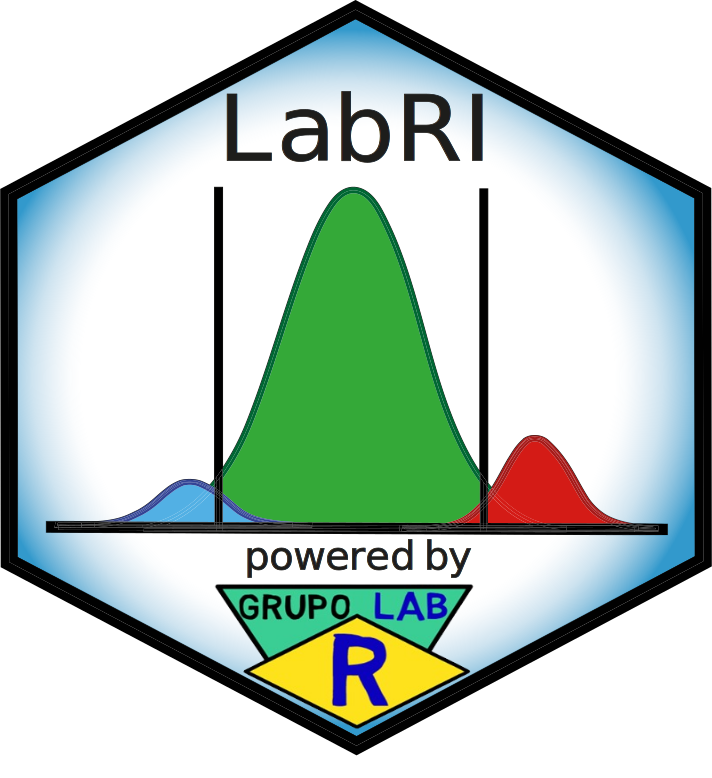

# LabRI Tool

## Introduction

The **LabRI Tool** is an RMarkdown-based tool designed for the estimation and verification of reference intervals in clinical laboratories. This tool, included in the **LabRI package** (a zipped folder with all necessary files and resources), incorporates the **LabRI method**, which is structured into two main modules:

- **Estimation Module**: Focuses on the adaptive and multi-criteria estimation of reference intervals using data cleaning, transformation, and clustering techniques, supported by algorithms like `refineR`, `reflimR`, and Expectation-Maximization (EM).
  
- **Verification Module**: Ensures the validity of estimated reference intervals through a three-level analysis, which evaluates statistical uncertainty, equivalence, and concordance, making the intervals reliable for clinical application.

## A. Estimation Module

The **LabRI method** provides an adaptive and multi-criteria approach for the **indirect estimation** of reference intervals. This module integrates data cleaning, transformation, and clustering techniques, utilizing the `refineR`, `reflimR`, and **EM algorithms**. By combining **parametric and non-parametric percentile** approaches, the method estimates population reference intervals based on the number of clusters in the truncated distribution.

### Characteristics of the LabRI Method

- **Adaptive**: 
  - Adjusts dynamically based on data structure and characteristics, applying appropriate cleaning and transformation techniques.
  - Uses the **Centroid of Windsorized Reference Limits** method with `refineR` and `reflimR` for multi-cluster distributions.
  - For single-cluster distributions, the expectation-maximization algorithm applies parametric and non-parametric methods to derive the best reference interval estimate.

- **Multi-criteria**:
  - Incorporates multiple criteria and methods for robust and comprehensive estimation and verification of reference intervals.

## B. Verification Module

To ensure reliability in clinical practice, it is crucial for laboratories to verify their reference intervals (RIs) before routine application. This verification is especially important for RIs derived through indirect methods.

### Structure of the Verification Module

The **Verification Module** performs a **three-level analysis** to assess whether the compared reference limits are equivalent:

1. **First-Level Analysis ~ Statistical Uncertainty**: Assesses the magnitude of statistical uncertainty in the reference limits.
2. **Second-Level Analysis ~ Distance Criterion Based on Equivalence Testing**: Compares the LabRI-estimated reference limit with a comparative limit to evaluate practical significance.
3. **Third-Level Analysis ~ Concordance Evaluation**: Evaluates concordance using tests like Fleiss’ Kappa, Lin’s Concordance Correlation Coefficient, and Flagging Rates.

### Details of the Three-Level Analysis

- **First-Level Analysis**:
  - Evaluates statistical uncertainty associated with reference limits. If uncertainty is within acceptable bounds, the analysis proceeds to the second level.

- **Second-Level Analysis**:
  - Compares the LabRI reference limit with a comparative reference limit using equivalence testing to assess practical significance.

- **Third-Level Analysis**:
  - Conducted if the second-level analysis suggests "Possible Equivalence" or "Probable Equivalence". This level incorporates confidence intervals and uses Fleiss' Kappa, Lin's Concordance Correlation Coefficient, and Flagging Rates to ensure robust verification.

---

A tutorial for installing the necessary resources and using the tool can be found on the **Grupo Lab R website**:

 
   

---

## Contact

You are welcome to:

Submit suggestions and Bugs at: https://github.com/labrgrupo/LabRI_Tool/issues

Write an Email with any questions and problems to: alancdias@hotmail.com

Link to the publication: 

---
